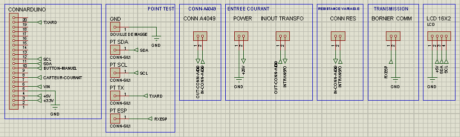
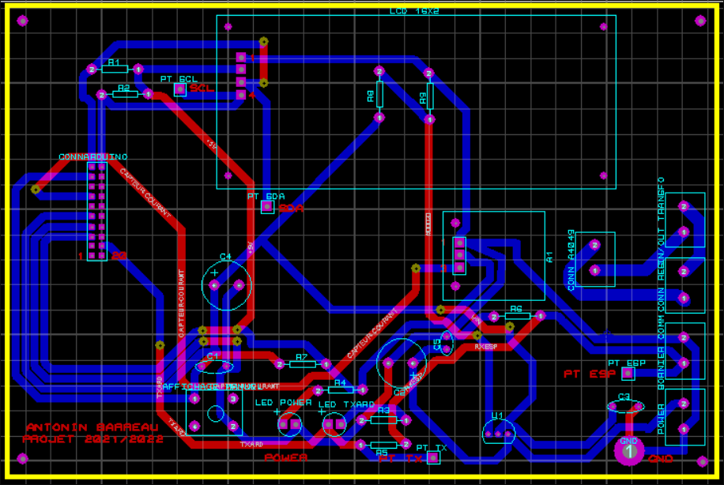

## Projet bts
## Contenu github
* [Info General](#Info-General)
* [Contenue](#Contenue)
* [Technologies](#technologies)
* [Schéma structurelle](#Schéma-structurelle)
* [Carte](#Carte)
* [Setup](#setup)

## Info General
Ce projet consiste à capter le courant et une fois fais le renvoyer sur une passerelle MQTT envoyer en RS232.

## Contenue
Ce github contient:
* Fichier stl et gcode
* Fichier ARES ISIS
* Documentation
	
## Technologies
Projet est crée avec:
* Un arduino uno
* Alimenté en +28V
* Carte A4049 (capteur de courant)

## Schéma structurelle




## Carte


	
## Setup
Pour cloner le projet:

```
gh repo clone rembot-industrie/projet-bts
```
