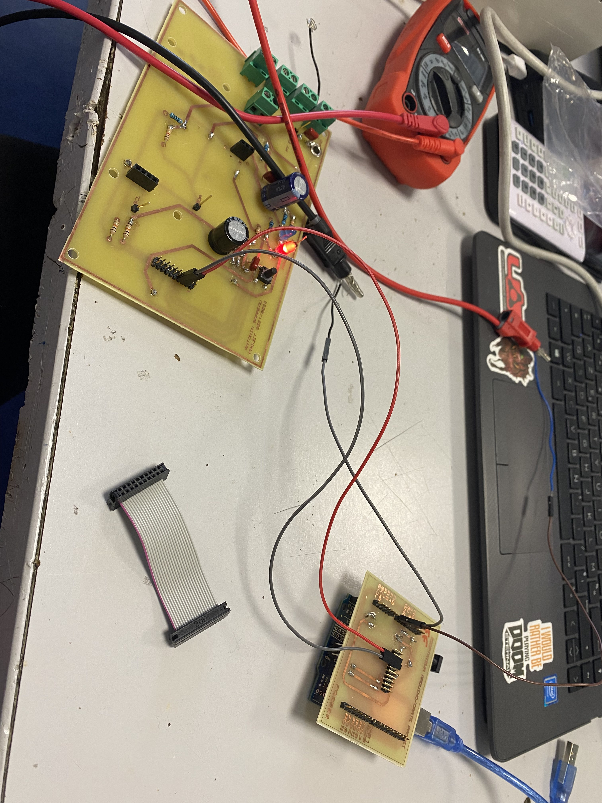
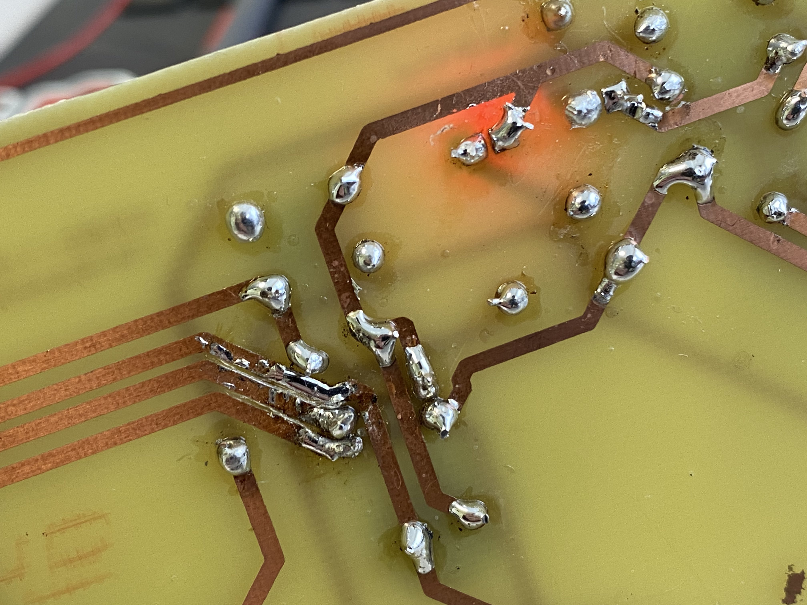
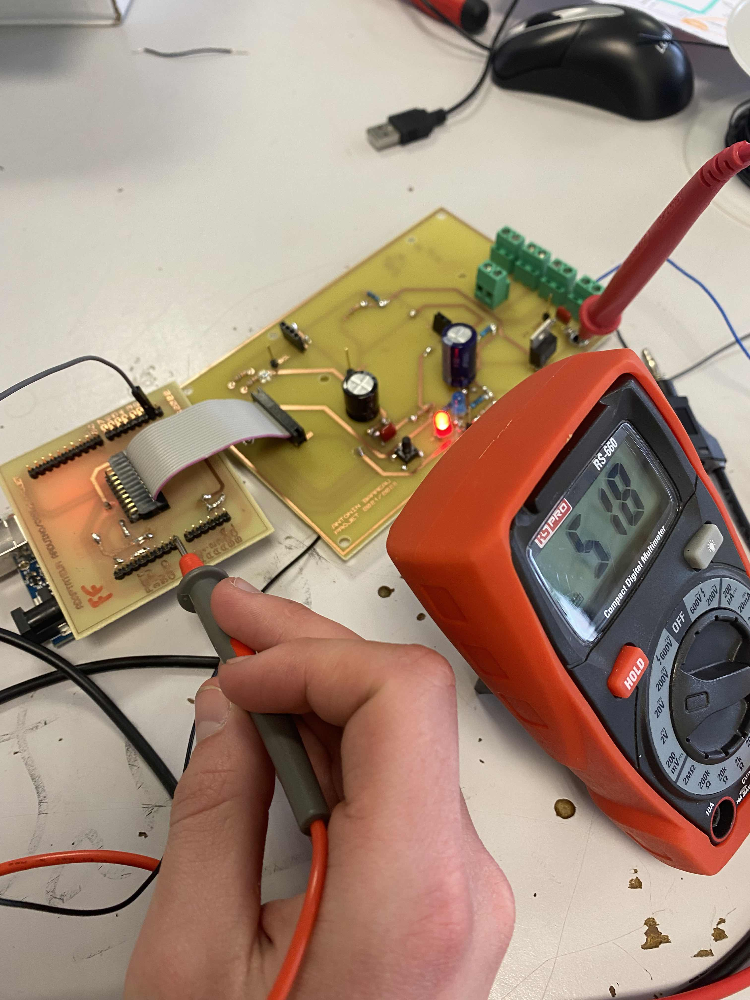
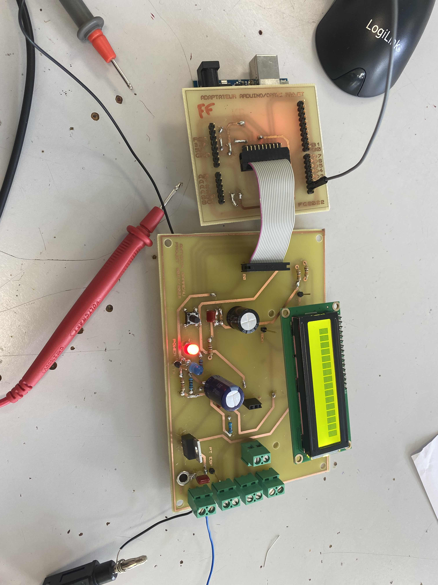
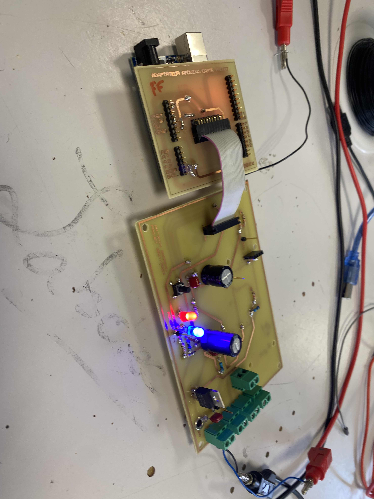
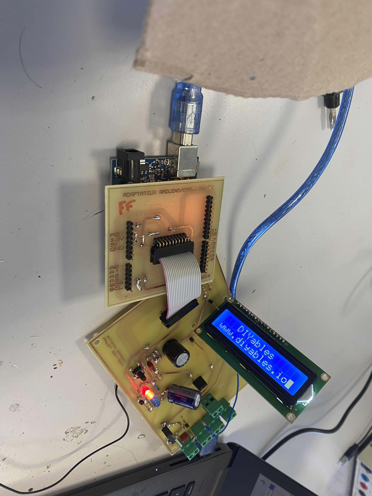
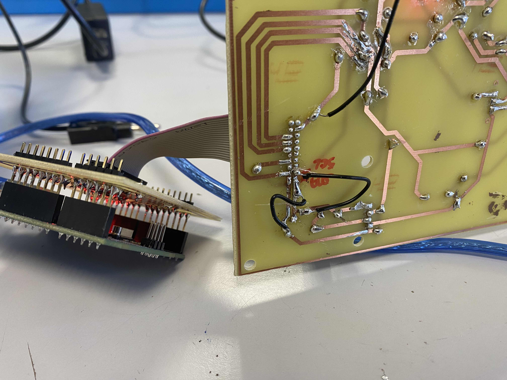

## Projet bts
## Problème carte
* [1. Court-circuit entre le VIN et le GND](#1.-Court-circuit-entre-le-VIN-et-le-GND)
* [2. Sous alimentation VIN arduino](#2.-Sous-alimentation-VIN-arduino)
* [3. Problème led TX](#3.-Problème-led-TXD)
* [4. Problème SDA, SCL](#4.-Problème-SDA,-SCL)
* [5. Problème conn-arduino](5.-Problème-conn-arduino)

## Phase de test
Tableau utiliser pour le dépannage.

| **Fonction** | Statut probleme|  Description  |    Tension    |
| :----------- | :------------: | ------------: | ------------: |
| CONN Capteur |       Ok       |               |      +5V      |
|     SDA     |  IMPORTANT  |  Problème conception inversion conn | +5V  |
|     SCL     |  IMPORTANT  |  Problème conception inversion conn | +5V  |
| BOUTON |       Ok       |               |      +V      |
|     LED ALIM    |  GRAVE  |  Court-circuit entre Vin et Gnd | +5V  |
|     LED RX   |  MOYEN |  Court-circuit entre entre les pin led | +5V  |
| ALIM PRINCIPAL |       Ok       |               |      +28V     |
| VIN |  IMPORTANT  | SOUS ALIMENTATION ARDUINO PONT DIVISEUR  |      +7.40V     |
| CONN-ARDUINO |  MOYEN  | SOUDURE PINS  |          |

## 1. Court-circuit entre le VIN et le GND
Lors de la mise en tension de la carte aucune led ne s'allume après plusieurs recherche il y avait un très léger filet d’étain entre le VIN et le GND comme sur la photo ci-dessous

- Le probleme:
Dès que la carte est sous tension l'arduino se met en erreur et aucune led sur la platine ne s'allume

- Pour dépanner:
C'est simple j'ai brancher câble par câble pour trouver le court-circuit.
La panne n'a pas était retrouvé avec cette solution.

J'ai ensuite utilisé le multimètre et tester les continuités, j'ai fini par tomber sur le problème.
- Solution: Un coup de cuter entre les pistes.

## 2. Sous alimentation VIN arduino

Lors de prise de mesure quand la platine est alimenté avec l’alimentation labo l'arduino n'envoie pas la tension « normale » Par exemple il envoyait du +4V au lieu du +5V. Il y a une erreur sur le pont diviseur,
L'arduino s'alimente au vin entre +7V et +12V Avec la prise de mesure a la sortie du régulateur il y avait que du +5V, l'arduino à un régulateur et comme l'arduino était sous alimenté il ne pouvait pas fournir la tension demandé.

En calculant le pont diviseur du régulateur j'ai changé et j'obtiens du environ +7.40V

## 3. Problème led TX

Problème: La led tx ne s'allume pas.

Lors de test la led tx ne s'allume pas.
Pour la tester j'ai utiliser un gbf avec pour le dépanage
| **Fréquence**|   Volt (GPP)   |
| :----------- | :------------: |
|      10k     |      +5 V      |

( On utilise le gbf pour simuler le tx de l'arduino)

En regardant la led j'ai vu une soudure raté j'ai simplement mis un coup de cuter et tout s'est mis à fonctionner.

## 4. Problème SDA, SCL

- Problème : L'écran lcd n'affiche rien.
- Supposition : Inversion conn du conn-arduino lors de la création du schéma structurelle.
- Solution : Coupé les pistes et soudé des cables du connecteurs au pistes.

Il y eu une inverssion de pins ce qui cause une panne problèmatique.

## 5. Problème conn-arduino

- Problème : L'Afficheur à un mauvais contact
- Solution : Ressouder le conn-arduino.

